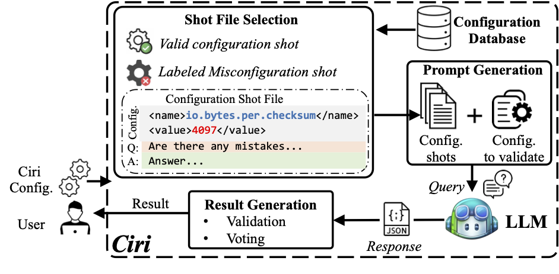

# Ciri 
## 📜 Overview
🌟Ciri🌟 is an advanced LLM-driven configuration validation framework, and also serves as an open platform for future research.


## 🚨 Prerequisites
GPT4 & GPT 3.5: Please follow the instruction from official [OpenAI website](https://help.openai.com/en/articles/5112595-best-practices-for-api-key-safety) to set the API KEY.

Claude-3-Opus & Claude-3-Sonnet: Please follow the instruction from official [Claude AI website](https://docs.anthropic.com/claude/reference/client-sdks) to set the API KEY.

CodeLlama 7B/13B/34B & DeepSeek: Please make sure you have the computation resources to run the model.
## 🔥 Quick Start
```bash
git clone https://github.com/ciri4conf/ciri.git
cd ciri 
pip install -r requirements.txt
```

Running an example:
```bash
python3 -m ciri.ciri_eng --input ciri/input/sample_input --output ciri/output/sample_output --model {model_name} --system hcommon --version 3.3.0
```
The output should be:
```bash
[Ciri] Start
[Ciri] Running for file ciri/input/sample_input/hcommon_ex.xml
[Ciri] Result: There are 1 misconfiguration parameters in the input: fs.default.name
[Ciri] Reason for fs.default.name: The property 'fs.default.name' has the value 'file//' which does not follow the correct URI format.
[Ciri] Writing log file to ciri/output/sample_output/hcommon_ex.xml
[Ciri] End
```

## 🤔 Running Ciri with customized features 
<div align="left">

| Parameter                | Description                                        | Options                            |
|--------------------------|----------------------------------------------------|------------------------------------|
| input-path               | Directory or file path for the configuration files | ```directory or file path```       |
| output-path              | Directory where the output will be saved           | ```directory```                    | 
| model                    | LLM model to be queried                            | Refer to "Supported Models" list   |
| system                   | Name of the evaluated system                       | E.g., hcommon                      |
| version                  | Specific version of the system                     | E.g., 3.3.0                        |
| validconfig-shot-num     | Number of valid config shots to use                | E.g., 1                            |
| misconfig-shot-num       | Number of misconfig shots to use                   | E.g., 3                            |
| file-format              | Format of the config file                          | E.g., XML, INI                     |
| code-retrieval-path      | Path to the code repository                        | ```directory or file path```       |
| language                 | Project Programming Language                       | E.g., java                         |
| alternate-shot-system    | System name for sourcing alternate shot            | E.g., hcommon                      |
</div>


## 🚀 Support Table

<div align="left">

| Models                | Status    |
|-----------------------|-----------|
| GPT-4                 | ✅         |
| GPT-3.5               | ✅         |
| Claude-3-Opus         | ✅         |
| Claude-3-Sonnet       | ✅         |
| CodeLlama 7B/13B/34B  | ✅         |
| Llama2                | ✅         |

✅: Supported;  🔨: Coming soon;

</div>
