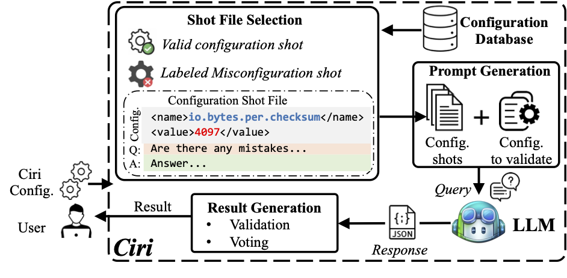

# Ciri 
## 📜 Overview
🌟Ciri🌟 is an advanced LLM-driven configuration validation framework, and also serves as an open platform for future research.


## 🚨 Prerequisites
Please follow the instruction from official [OpenAI website](https://help.openai.com/en/articles/5112595-best-practices-for-api-key-safety) to set the API KEY.
## 🔥 Quick Start
```bash
git clone https://github.com/ciri4conf/ciri.git
cd ciri 
pip install -r requirements.txt
```

Running an example:
```bash
python3 -m ciri.ciri_eng --input ciri/input/sample_input --output ciri/output/sample_output --model code-davinci-002 --system hcommon --version 3.3.0
```
The output should be:
```bash
[Ciri] Start
[Ciri] Running for file ciri/input/sample_input/core-site.xml
[Ciri] Result: There are 1 misconfiguration parameters in the input: fs.default.name
[Ciri] Reason for fs.default.name: The property 'fs.default.name' has the value 'file//' which does not follow the correct URI format.
[Ciri] Writing log file to ciri/output/sample_output/core-site.xml
[Ciri] End
```

## 🤔 Running Ciri with customized features 
<div align="left">

| Parameter | Description | Options  |
|---|---|---|
| input_path | Path of the config files | ```directory or file path``` |
| output_path | Location where the output to save  | ```directory or file path``` | 
| model | LLM model to query   | See "Support Table" for list|
|system| Name of the evaluated system | E.g., hcommon |
|version| Specific version of the system | E.g., 3.3.0 |
|validconfig_shot_num| Number of valid config shots to use | E.g., 1 |
| misconfig_shot_num|Number of misconfig shots to use |E.g., 3 |
| shot_selection|Strategy to select shots|random,category,similarity,category+similarity|
</div>


## 🚀 Support Table

<div align="left">

| Models | Status |
|---|---|
| GPT-4  | ✅ |
| GPT-3.5-turbo | ✅ |
| Code-Davinci-002 | ✅|
| Babbage-002| ✅|
| Davinci-002| ✅|
| Code-Llama-002 |🔨 |
| PaLM | 🔨|

✅: Supported;  🔨: Coming soon;

</div>
